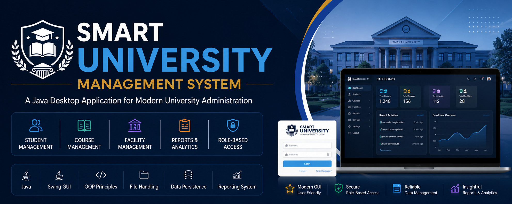
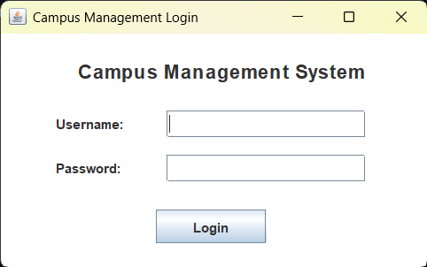
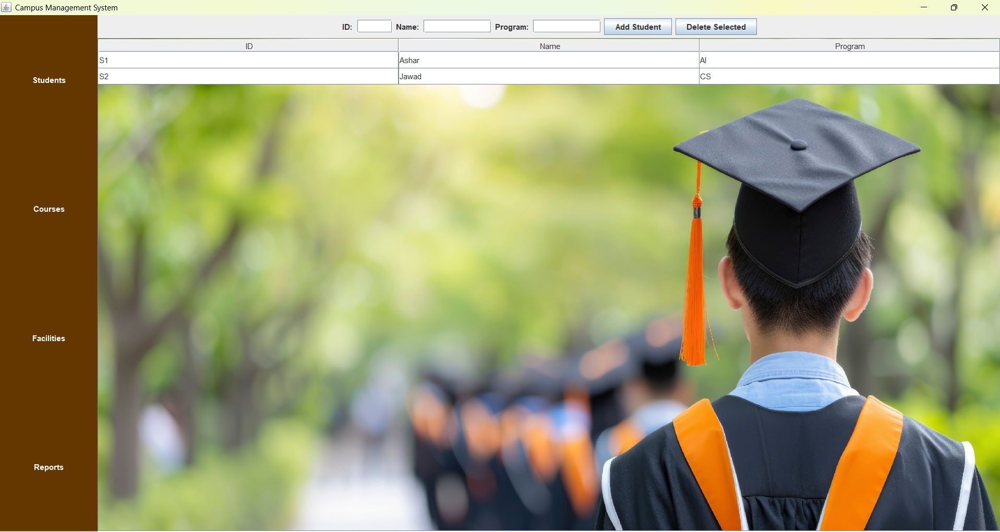
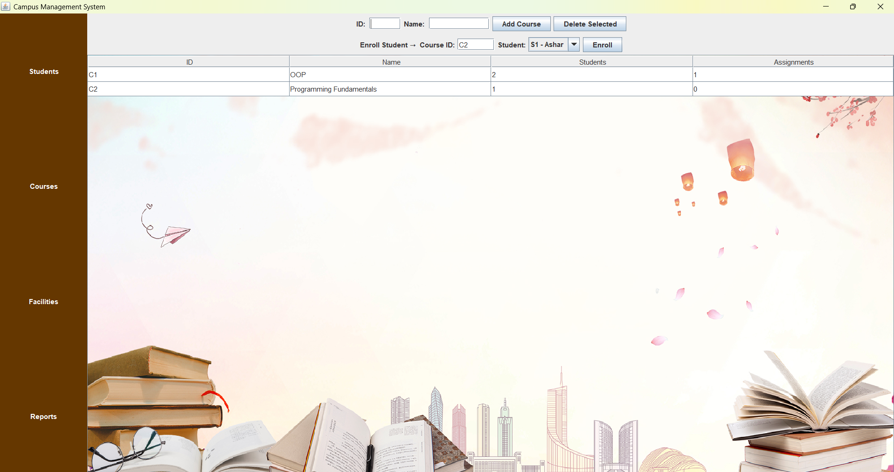
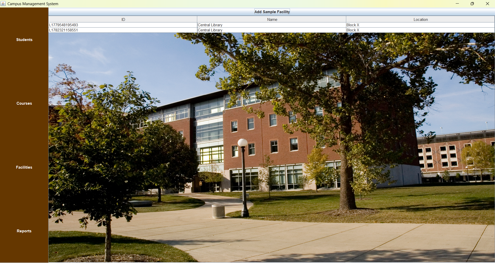
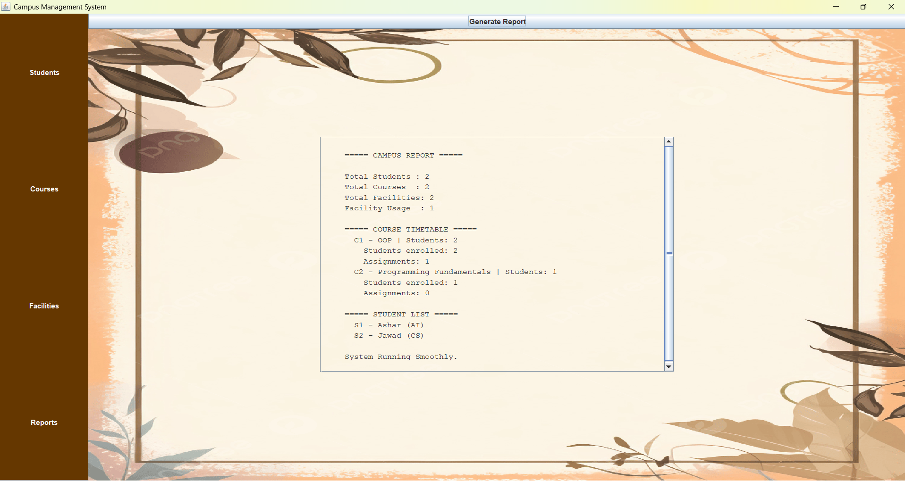
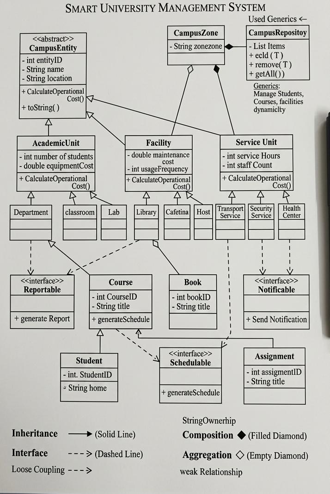

# 🎓 Smart University Management System



A Java-based desktop application developed as a Semester Project for the Object-Oriented Programming (OOP) course.

The system simulates a modern university environment by managing students, courses, facilities, campus services, classrooms, laboratories, and administrative operations through a graphical user interface (GUI).

---

## 📌 Project Overview

The Smart University Management System is designed to demonstrate practical implementation of Object-Oriented Programming concepts in a real-world academic management scenario.

The project incorporates:

- Student Management
- Course Management
- Facility Management
- Campus Zone Management
- Role-Based Access Control
- File Handling & Data Persistence
- Reporting & Notifications
- Interactive Java Swing GUI

---

## 🚀 Features

### 👨‍🎓 Student Management
- Add students
- Update student information
- Remove students
- Search students by ID
- Enroll students in courses

### 📚 Course Management
- Create and manage courses
- Assign students to courses
- Manage assignments
- Generate course reports

### 🏫 Campus Facilities
- Library Management
- Cafeteria Management
- Classroom Management
- Laboratory Management
- Hostel Facilities
- Health Center Services

### 🛡️ Campus Services
- Security Services
- Transport Services
- Emergency Handling System
- Notification System

### 📊 Reporting
- Student reports
- Course reports
- Facility reports
- Administrative reports

### 💾 Data Persistence
- Save system data using serialization
- Load previously saved records
- Backup support

---

## 🧠 OOP Concepts Implemented

This project was developed to demonstrate the core principles of Object-Oriented Programming:

### Encapsulation
- Private data members with controlled access through getters and setters.

### Inheritance
- Shared functionality inherited across academic units, facilities, and service classes.

### Polymorphism
- Method overriding and dynamic behavior implementation.

### Abstraction
- Abstract classes used to define common structures.

### Interfaces
- `Notifiable`
- `Reportable`
- `Schedulable`

### Exception Handling
- Custom exceptions for duplicate entries and missing records.

### Generics
- Generic repository implementation for reusable data management.

---

## ✨ Key Highlights

- Developed using Object-Oriented Programming principles
- Interactive Java Swing graphical user interface
- Generic repository implementation
- File-based data persistence using serialization
- Role-based university management workflow
- UML-based software design and architecture
- Semester Final Project for BS Artificial Intelligence

## 🛠️ Technologies Used

| Technology | Purpose |
|------------|---------|
| Java | Core Development |
| Java Swing | GUI Development |
| Object-Oriented Programming | Software Design |
| File Handling | Data Persistence |
| Serialization | Data Storage |
| IntelliJ IDEA | Development Environment |

---

## 📂 Project Structure

```text
src
│
├── controller
├── gui
├── interfaces
├── model
├── repository
├── utils
└── main
```

---

# 📸 Application Screenshots

## Login Screen



---

## Student Management



---

## Course Management



---

## Facility Management



---

## Reports Section



---

## UML Class Diagram



---

## ⚙️ How to Run

1. Clone the repository

```bash
git clone https://github.com/YourUsername/smart-university-management-system.git
```

2. Open the project in IntelliJ IDEA.

3. Run:

```text
src/main/TestRun.java
```

4. The login window and management system will launch.

---

## 👥 Team Members

### Ashar Rizwan
BS Artificial Intelligence

### Faraz Tariq
BS Artificial Intelligence

---

## 🎯 Learning Outcomes

Through this project we gained practical experience in:

- Java Programming
- GUI Development
- OOP Design Principles
- Software Architecture
- File Handling
- Team Collaboration
- Git & GitHub Usage

---

## 📄 Academic Information

Semester Project for the Object-Oriented Programming (OOP) Course.

Developed as part of the BS Artificial Intelligence undergraduate curriculum.

---

⭐ If you found this project interesting, consider giving the repository a star.
